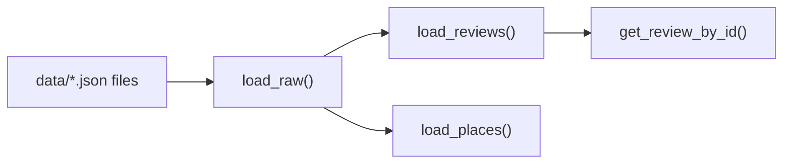

# `data_loader.py` — how it works

Loads the scraped Google Maps JSON exports from `data/` and turns them into typed `Place`/`Review` objects used everywhere downstream (RAG index, eval harness).

## Data model

```python
Place    # one restaurant: name, address, categories, google_rating, ...
Review   # one review: review_id, place_name, rating, text, language, timestamp, owner_response
```

## Pipeline (3 cached stages)



### 1. `load_raw()` — merge + dedupe + filter
- Globs every `*.json` in `config.DATA_DIR` (default `data/`), sorted by filename.
- Reads each file as a JSON array of flat scraper rows (one row = one review, with the parent place's fields prefixed `place*` embedded in every row).
- **Geo filter**: drops rows whose `placeAddress` doesn't mention "germany"/"deutschland" — the scraper can accidentally match same-named venues in other cities/countries (e.g. "Berlin, Maryland").
- **Dedupe**: tracks `reviewId` in a `seen_ids` set; if a review appears in multiple export files (e.g. re-scraped over time), only the first occurrence is kept.
- Cached with `@lru_cache(maxsize=1)` — file I/O + parsing happens once per process.
- Raises `FileNotFoundError` if no JSON files exist in `DATA_DIR`.

### 2. `load_reviews()` — flatten into `Review` objects
- Iterates `load_raw()`, skips rows with empty/whitespace-only `text` (no point indexing empty reviews).
- Maps raw scraper field names (`placeName`, `ownerResponseText`, etc.) to the `Review` dataclass.
- `review_id` is coerced to `str` so IDs are consistent regardless of source JSON type (int/string).
- Also cached (`lru_cache(maxsize=1)`) — this is the list the RAG index (`ReviewIndex` in `src/rag/index.py`) is built from.

### 3. `load_places()` — one row per restaurant
- Also iterates `load_raw()`, but keeps only the **first row seen per `placeName`** (place-level fields are duplicated across every review row in the scraper export, so this just de-flattens back to one `Place` per restaurant).
- Captures address, categories, Google rating/review count, phone, website, description — used by the `list_places` and `get_place_stats` tools in `src/agents/tools.py`.

### 4. `get_review_by_id(review_id)`
- Linear scan over `load_reviews()` (cheap since it hits the cached list, and dataset is only ~1.6k reviews).
- Used by the `verify_quote` tool to fetch the ground-truth review text for citation verification.

## Why the caching matters
All three loader functions are `@lru_cache(maxsize=1)` (no-arg singletons), so:
- The JSON files are parsed exactly once per process lifetime.
- The FastAPI backend's single `Coordinator` instance (created at startup, see `backend/main.py`) and the eval harness all share the same in-memory dataset without redundant disk reads.
- Adding new dataset files requires a **process restart** (per the [Quickstart](../QUICKSTART.md) §4/§5) — the cache won't pick up new files otherwise.

## How it plugs into the RAG pipeline
1. `src/rag/index.py`'s `get_index()` calls `load_reviews()` once and embeds each review (plus its place's categories/description) with a local HuggingFace sentence-transformer (`BAAI/bge-small-en-v1.5`), indexed as a llama_index `VectorStoreIndex`. The index is persisted to `data/.index_cache` and only re-embedded when the corpus hash changes.
2. The `search_reviews` tool queries that index via a `VectorIndexRetriever` (cosine similarity, thresholded by `config.MIN_SEARCH_SIMILARITY`) and returns `reviewId`s + snippets to the researcher agent.
3. The researcher cites reviewIds in its structured claims; the orchestrator's verifier calls `verify_quote` → `get_review_by_id` to re-check the claim against the real review text with a local NLI entailment model before trusting it — a deterministic pass/fail check on top of the semantic retrieval above.
4. The eval harness (`run_eval.py`) additionally scores answers with an LLM-judge (`src/eval/llm_judge.py`, faithfulness + answer relevancy) when an Anthropic key is configured — a model-based quality signal that catches issues the deterministic citation check can't, such as a compound claim stitched together from two individually-true citations.
